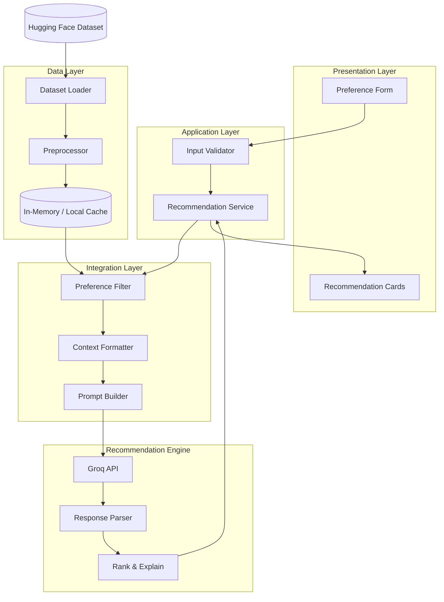
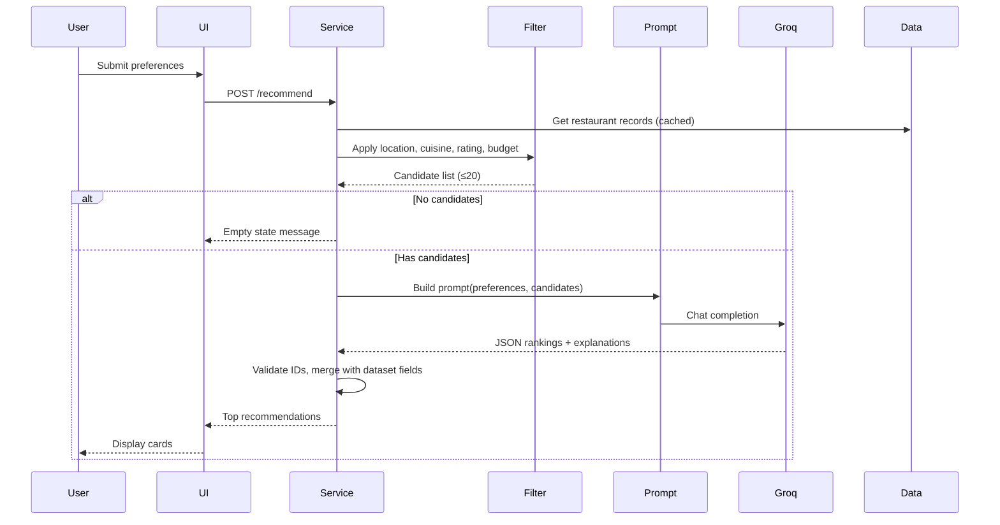

**System Architecture: AI-Powered Restaurant Recommendation System**

**Purpose**

This document defines the technical architecture for a Zomato-inspired restaurant recommendation service. It expands on `docs/context.md` into implementable components, data flows, interfaces, and design decisions. The system combines structured restaurant data from Hugging Face with **Groq** as the LLM provider to deliver personalized, explainable recommendations.

**Architecture Principles**

- *Separation of concerns* — data loading, filtering, AI reasoning, and presentation are isolated layers
- *Structured-first, LLM-second* — narrow the candidate set with deterministic filters before invoking the LLM
- *Explainability* — every recommendation includes a human-readable rationale from the LLM
- *Simplicity* — start with a single-process or lightweight client–server design; scale only when needed
- *Testability* — each layer can be validated independently (data pipeline, filters, prompt, UI)

---

**High-Level Architecture**

The system follows a five-layer pipeline aligned with the workflow in `context.md`:

```
┌─────────────────────────────────────────────────────────────────────────┐
│                         Presentation Layer                              │
│              (Web UI / CLI — collects prefs, shows results)             │
└─────────────────────────────────┬───────────────────────────────────────┘
                                  │
                                  ▼
┌─────────────────────────────────────────────────────────────────────────┐
│                         Application Layer                               │
│         (Orchestrates request flow, validation, error handling)           │
└─────────────────────────────────┬───────────────────────────────────────┘
                                  │
          ┌───────────────────────┼───────────────────────┐
          ▼                       ▼                       ▼
┌──────────────────┐  ┌──────────────────┐  ┌──────────────────────────┐
│  Data Ingestion  │  │ Integration Layer│  │  Recommendation Engine   │
│  & Storage       │  │ (Filter + Prompt)│  │  (LLM ranking + explain) │
└──────────────────┘  └──────────────────┘  └──────────────────────────┘
          │                       │                       │
          └───────────────────────┴───────────────────────┘
                                  │
                                  ▼
                    ┌──────────────────────────┐
                    │   External Dependencies  │
                    │  Hugging Face Dataset    │
                    │  Groq API                │
                    └──────────────────────────┘
```



---

**Component Breakdown**

**1. Presentation Layer**

*Responsibility:* Collect user preferences and render ranked recommendations.

| Element | Description |
|---------|-------------|
| **Preference form** | Inputs for location, budget tier, cuisine, minimum rating, and free-text extras |
| **Results view** | Cards or list showing name, cuisine, rating, cost, and AI explanation |
| **Loading / error states** | Feedback while the LLM processes; graceful fallback on failure |
| **Optional summary** | Short LLM-generated overview of the top picks |

*Suggested interfaces:*
- **Web app** — Streamlit or FastAPI + simple HTML/React frontend (fastest path to demo)
- **CLI** — argparse-based script for local testing and automation

*Output per recommendation:*

| Field | Source |
|-------|--------|
| Restaurant name | Dataset |
| Cuisine | Dataset |
| Rating | Dataset |
| Estimated cost | Dataset |
| AI explanation | LLM |
| Rank order | LLM (validated against filtered set) |

---

**2. Application Layer**

*Responsibility:* Coordinate the end-to-end recommendation request.

**RecommendationService** (core orchestrator)

```
receive(user_preferences)
  → validate(preferences)
  → candidates = filter_restaurants(preferences)
  → if candidates.empty: return empty_result_with_message
  → prompt = build_prompt(preferences, candidates)
  → llm_response = call_llm(prompt)
  → recommendations = parse_and_validate(llm_response, candidates)
  → return format_output(recommendations)
```

| Concern | Approach |
|---------|----------|
| **Validation** | Reject invalid locations, out-of-range ratings, unknown budget tiers |
| **Empty results** | Return user-friendly message before calling LLM if filter yields zero matches |
| **Timeouts** | Cap LLM call duration; return partial or cached fallback if exceeded |
| **Logging** | Log preference hash, candidate count, latency, and token usage (no PII in logs) |

---

**3. Data Ingestion & Storage**

*Responsibility:* Load, clean, and serve restaurant records from Hugging Face.

**Dataset source**

- **Repository:** `ManikaSaini/zomato-restaurant-recommendation`
- **URL:** https://huggingface.co/datasets/ManikaSaini/zomato-restaurant-recommendation
- **Load method:** `datasets.load_dataset()` via Hugging Face `datasets` library

**Ingestion pipeline**

```
Download dataset
  → Inspect schema (column names may vary)
  → Map raw columns to canonical Restaurant model
  → Normalize (trim strings, parse ratings, standardize cost)
  → Deduplicate by name + location
  → Cache locally (Parquet / JSON / in-memory DataFrame)
```

**Canonical data model — Restaurant**

| Field | Type | Notes |
|-------|------|-------|
| `id` | string | Stable identifier (generated if absent in source) |
| `name` | string | Restaurant name |
| `location` | string | City or area (normalized, e.g. "Bangalore", "Delhi") |
| `cuisines` | list[string] | One or more cuisine tags |
| `rating` | float | Normalized to 0–5 scale |
| `cost_for_two` | int / string | Raw cost; map budget tiers at filter time |
| `address` | string | Optional |
| `rest_type` | string | Optional (e.g. casual dining, cafe) |
| `online_order` | bool | Optional |
| `book_table` | bool | Optional |
| `votes` | int | Optional popularity signal |

**Preprocessing rules**

- *Location normalization* — lowercase, strip whitespace, alias map (e.g. "Bengaluru" → "Bangalore")
- *Cuisine parsing* — split comma-separated values into a list
- *Rating* — coerce to float; drop or impute invalid entries
- *Cost* — parse numeric ranges; derive budget tier labels (low / medium / high) using dataset percentiles or fixed thresholds

**Storage strategy (phased)**

| Phase | Strategy |
|-------|----------|
| **MVP** | In-memory pandas DataFrame loaded at startup |
| **Growth** | Local Parquet cache to avoid re-downloading |
| **Scale** | SQLite or PostgreSQL if dataset grows or multi-user concurrency is needed |

---

**4. Integration Layer**

*Responsibility:* Deterministic filtering and LLM context preparation.

**4a. Preference Filter**

Maps user input to query constraints before any LLM call.

**User preferences model**

| Field | Type | Example |
|-------|------|---------|
| `location` | string | "Bangalore" |
| `budget` | enum | `low` \| `medium` \| `high` |
| `cuisine` | string | "Italian" |
| `min_rating` | float | 4.0 |
| `additional_preferences` | string | "family-friendly, quick service" |

**Filter logic (deterministic)**

```
candidates = all_restaurants
candidates = candidates where location matches (case-insensitive)
candidates = candidates where cuisine contains requested type
candidates = candidates where rating >= min_rating
candidates = candidates where cost tier matches budget
candidates = sort by rating desc, then votes desc
candidates = take top N (e.g. 15–25) for LLM context window
```

| Parameter | Recommended default |
|-----------|---------------------|
| **Max candidates to LLM** | 20 (balance quality vs. token cost) |
| **Min candidates** | 3 (if fewer, pass all; if 0, skip LLM) |
| **Budget mapping** | Define thresholds from dataset distribution |

**4b. Context Formatter**

Serialize filtered restaurants into a compact, structured block for the prompt:

```
[
  {"id": "r1", "name": "...", "cuisine": "...", "rating": 4.5, "cost": "...", "location": "..."},
  ...
]
```

Keep only fields the LLM needs for ranking and explanation.

**4c. Prompt Builder**

Constructs a system + user prompt with:

- User preferences (structured)
- Candidate restaurant list (JSON or table)
- Instructions to rank, explain, and optionally summarize
- Output format specification (JSON schema for reliable parsing)

---

**5. Recommendation Engine (Groq)**

*Responsibility:* Rank candidates, generate explanations, and optionally summarize using the **Groq** inference API.

**Groq LLM role**

Groq is *not* responsible for discovering restaurants outside the filtered set. It:

1. Ranks the provided candidates by fit to user preferences
2. Writes a short explanation per pick (1–2 sentences)
3. Optionally produces a brief summary of the overall selection

**Prompt structure**

| Section | Content |
|---------|---------|
| **System** | Role ("restaurant recommendation assistant"), constraints, output JSON schema |
| **User preferences** | Location, budget, cuisine, min rating, additional notes |
| **Candidates** | Filtered list (id, name, cuisine, rating, cost, location) |
| **Task** | Rank top K (e.g. 5), explain each, summarize if requested |
| **Rules** | Only recommend from provided list; cite preference match in explanations |

**Expected LLM output schema**

```json
{
  "summary": "Optional one-paragraph overview of recommendations.",
  "recommendations": [
    {
      "restaurant_id": "r1",
      "rank": 1,
      "explanation": "Matches your Italian preference in Bangalore with a 4.6 rating and mid-range budget."
    }
  ]
}
```

**Response validation**

- Every `restaurant_id` must exist in the filtered candidate set
- Ranks must be unique and sequential
- On parse failure: retry once with a "respond only in JSON" reminder; else fall back to rating-sorted list with generic explanations

**Groq integration**

| Item | Detail |
|------|--------|
| **Provider** | [Groq](https://groq.com/) — high-speed LLM inference API |
| **Python SDK** | `groq` — official client for chat completions |
| **Default model** | `llama-3.3-70b-versatile` (strong reasoning and JSON adherence; alternatives: `llama-3.1-8b-instant` for lower latency) |
| **API endpoint** | Groq Chat Completions API |
| **Auth** | `GROQ_API_KEY` environment variable |

**Groq client usage (conceptual)**

```python
from groq import Groq

client = Groq(api_key=settings.GROQ_API_KEY)
response = client.chat.completions.create(
    model=settings.GROQ_MODEL,
    messages=[
        {"role": "system", "content": system_prompt},
        {"role": "user", "content": user_prompt},
    ],
    temperature=0.3,
    response_format={"type": "json_object"},
)
```

*Configuration:* `GROQ_API_KEY` and `GROQ_MODEL` in `.env`; temperature and max tokens in `config.py`.

---

**End-to-End Data Flow**



**Request lifecycle (step-by-step)**

1. User submits preferences through the UI
2. Application layer validates and normalizes input
3. Filter queries the in-memory (or cached) restaurant store
4. If zero matches → return early with guidance to broaden criteria
5. Integration layer formats candidates and builds the Groq prompt
6. Groq returns structured rankings and explanations
7. Parser validates response and merges Groq output with full restaurant metadata
8. Presentation layer renders the top N results

---

**API Design (if using a backend)**

**POST /api/recommend**

*Request body:*

```json
{
  "location": "Bangalore",
  "budget": "medium",
  "cuisine": "Italian",
  "min_rating": 4.0,
  "additional_preferences": "family-friendly, outdoor seating",
  "top_k": 5
}
```

*Response body:*

```json
{
  "summary": "These Italian spots in Bangalore balance rating, budget, and family-friendly dining.",
  "recommendations": [
    {
      "rank": 1,
      "name": "Example Bistro",
      "cuisine": "Italian",
      "rating": 4.6,
      "estimated_cost": "₹1,200 for two",
      "location": "Bangalore",
      "explanation": "Highly rated Italian restaurant within your medium budget, suitable for families."
    }
  ],
  "meta": {
    "candidates_considered": 18,
    "processing_time_ms": 2400
  }
}
```

**GET /api/health** — service and dataset load status

**GET /api/locations** — distinct cities (optional, for autocomplete)

**GET /api/cuisines** — distinct cuisine types (optional, for dropdown)

---

**Project Structure (recommended)**

```
restaurant-recommender/
├── app/
│   ├── main.py                 # Entry point (FastAPI / Streamlit)
│   ├── config.py               # Settings, env vars, model config
│   ├── models/
│   │   ├── restaurant.py       # Restaurant data class
│   │   └── preferences.py      # User preference schema
│   ├── data/
│   │   ├── loader.py           # Hugging Face dataset loading
│   │   ├── preprocessor.py     # Cleaning and normalization
│   │   └── repository.py       # Query / filter interface
│   ├── services/
│   │   ├── recommendation.py   # Orchestrator
│   │   ├── filter.py           # Deterministic filtering
│   │   └── groq_client.py      # Groq API client and prompt templates
│   └── api/
│       └── routes.py           # HTTP endpoints (if applicable)
├── prompts/
│   └── recommendation.txt      # Prompt template
├── tests/
│   ├── test_filter.py
│   ├── test_preprocessor.py
│   └── test_groq_parser.py
├── data/                       # Local cache (gitignored)
├── requirements.txt            # includes groq, datasets, pandas, pydantic, etc.
├── .env.example
└── README.md
```

---

**Technology Stack (recommended)**

| Layer | Technology | Rationale |
|-------|------------|-----------|
| **Language** | Python 3.11+ | Strong ML/data ecosystem, Hugging Face support |
| **Dataset** | `datasets`, `pandas` | Native Hugging Face loading and tabular filtering |
| **API (optional)** | FastAPI | Lightweight, async, auto OpenAPI docs |
| **UI (MVP)** | Streamlit | Rapid form + results UI without frontend build |
| **LLM** | Groq (`groq` SDK) | Fast inference for ranking and natural-language explanations |
| **Validation** | Pydantic | Request/response and preference schemas |
| **Config** | `python-dotenv` | Secure API key management |
| **Testing** | pytest | Unit tests for filter, parser, preprocessor |

---

**Cross-Cutting Concerns**

**Error handling**

| Scenario | Behavior |
|----------|----------|
| Dataset download fails | Retry with backoff; use local cache if available |
| Invalid user input | 400 with field-level error messages |
| Zero filter matches | 200 with empty list and suggestions to relax filters |
| Groq API timeout / failure | Fallback to rating-sorted results with template explanations |
| Malformed LLM JSON | Single retry; then deterministic fallback |

**Security & configuration**

- Store `GROQ_API_KEY` in `.env`; never commit secrets
- Sanitize free-text `additional_preferences` before prompt injection
- Rate-limit public API endpoints if deployed

**Performance**

- Load dataset once at startup (or lazy-load on first request)
- Cap candidates sent to Groq (≤20) to control latency and token usage; Groq's fast inference keeps end-to-end response times low
- Cache distinct locations/cuisines for UI dropdowns

**Observability**

- Log request ID, filter count, Groq API latency, token usage
- Optional: expose `/metrics` for candidate pool size and error rates

---

**Deployment Options**

| Mode | Description |
|------|-------------|
| **Local dev** | `streamlit run app/main.py` or `uvicorn app.main:app` |
| **Docker** | Single container with cached dataset volume |
| **Cloud** | Deploy API on Render / Railway / Azure; UI as static site or Streamlit Cloud |

**Environment variables**

| Variable | Purpose |
|----------|---------|
| `GROQ_API_KEY` | Groq API key (required) |
| `GROQ_MODEL` | Groq model identifier (default: `llama-3.3-70b-versatile`) |
| `GROQ_TEMPERATURE` | Sampling temperature (default: `0.3`) |
| `DATASET_CACHE_PATH` | Local path for cached Parquet |
| `MAX_CANDIDATES` | Upper bound on restaurants sent to Groq |
| `TOP_K` | Default number of recommendations returned |

---

**Testing Strategy**

| Layer | What to test |
|-------|--------------|
| **Preprocessor** | Location normalization, cuisine splitting, rating coercion |
| **Filter** | Each preference dimension independently and combined |
| **Prompt builder** | Correct inclusion of preferences and candidates |
| **LLM parser** | Valid JSON, invalid JSON, hallucinated restaurant IDs from Groq responses |
| **Integration** | End-to-end with mocked Groq client returning fixed JSON |
| **UI** | Form validation and empty-state rendering |

---

**Future Extensions**

- *Semantic search* — embed `additional_preferences` and match against restaurant descriptions
- *Hybrid ranking* — combine LLM score with deterministic rating/votes weighting
- *User feedback loop* — thumbs up/down to refine future prompts
- *Multi-location comparison* — side-by-side results for two cities
- *Persistent storage* — save search history and favorite restaurants
- *RAG enrichment* — augment candidates with reviews or menu snippets if added to the dataset

---

**Architecture ↔ Context Mapping**

| `context.md` workflow step | Architecture component |
|----------------------------|------------------------|
| Data Ingestion | Data Layer — Loader, Preprocessor, Cache |
| User Input | Presentation Layer — Preference form |
| Integration Layer | Filter, Context Formatter, Prompt Builder |
| Recommendation Engine | Groq client, Parser, Ranker |
| Output Display | Presentation Layer — Results view |

---

**Source**

This architecture is derived from `docs/context.md`, which is based on `docs/ProblemStatement.txt`.
