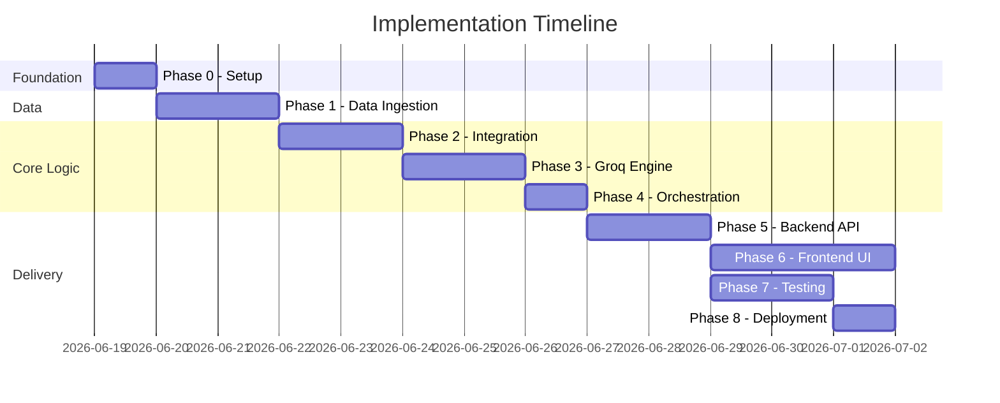

**Implementation Plan: AI-Powered Restaurant Recommendation System**

**Purpose**

This document provides a phase-wise build plan for the Zomato-inspired restaurant recommendation service. It translates `docs/context.md` and `docs/architecture.md` into ordered implementation steps with deliverables, acceptance criteria, and dependencies. The LLM provider for this project is **Groq**.

**Guiding approach**

- Build bottom-up: data first, then filtering, then Groq, then orchestration, then UI
- Validate each phase independently before moving to the next
- Ship a working CLI early; add Streamlit UI once the core pipeline is stable
- Keep scope tight in early phases; defer API, Docker, and cloud deployment to later phases

---

**Phase Overview**

| Phase | Name | Primary outcome | Depends on |
|-------|------|-----------------|------------|
| **0** | Project foundation | Runnable repo, config, dependencies | — |
| **1** | Data ingestion | Clean restaurant dataset in memory | Phase 0 |
| **2** | Integration layer | Filtered candidates + prompt builder | Phase 1 |
| **3** | Groq recommendation engine | Ranked results with AI explanations | Phase 2 |
| **4** | Application orchestration | End-to-end service (no UI) | Phase 3 |
| **5** | Backend Development | FastAPI endpoints, error handling, logging | Phase 4 |
| **6** | Frontend Development | Modern Web App (e.g., Next.js/React) for premium UI | Phase 5 |
| **7** | Testing & hardening | Unit + integration tests, fallbacks | Phases 1–6 |
| **8** | Deployment & docs | Runnable demo, README, optional Docker | Phase 7 |



---

**Phase 0 — Project Foundation**

*Goal:* Establish project structure, dependencies, and configuration so later phases have a consistent base.

**Tasks**

1. Create the recommended folder structure from `architecture.md`:
   - `app/`, `app/models/`, `app/data/`, `app/services/`, `prompts/`, `tests/`, `data/`
2. Add `requirements.txt` with core dependencies:
   - `groq`, `datasets`, `pandas`, `pydantic`, `python-dotenv`, `pytest`
   - `streamlit` (Phase 5), `fastapi`, `uvicorn` (Phase 6)
3. Create `app/config.py` — load settings from environment via Pydantic or `python-dotenv`
4. Create `.env.example` with:
   - `GROQ_API_KEY`, `GROQ_MODEL`, `GROQ_TEMPERATURE`
   - `DATASET_CACHE_PATH`, `MAX_CANDIDATES`, `TOP_K`
5. Add `.gitignore` — exclude `.env`, `data/`, `__pycache__/`, `.venv/`
6. Scaffold empty modules with docstrings (no logic yet)

**Deliverables**

| Artifact | Path |
|----------|------|
| Project skeleton | `app/` tree per architecture |
| Dependencies | `requirements.txt` |
| Config template | `.env.example`, `app/config.py` |
| Prompt placeholder | `prompts/recommendation.txt` |

**Acceptance criteria**

- [ ] `pip install -r requirements.txt` succeeds in a fresh virtual environment
- [ ] `app/config.py` reads `GROQ_API_KEY` and `GROQ_MODEL` without errors
- [ ] Folder structure matches `architecture.md`

**Maps to context:** Sets up infrastructure for all workflow steps

---

**Phase 1 — Data Ingestion**

*Goal:* Load the Hugging Face Zomato dataset, preprocess it, and expose a queryable in-memory store.

**Tasks**

1. **Dataset loader** (`app/data/loader.py`)
   - Use `datasets.load_dataset("ManikaSaini/zomato-restaurant-recommendation")`
   - Inspect raw schema; document column mapping in code comments
   - Convert to pandas DataFrame

2. **Preprocessor** (`app/data/preprocessor.py`)
   - Map raw columns → canonical `Restaurant` model
   - Normalize locations (trim, lowercase, alias map e.g. "Bengaluru" → "Bangalore")
   - Parse cuisines (split comma-separated strings into lists)
   - Coerce ratings to float (0–5); handle invalid values
   - Parse `cost_for_two`; derive budget tier (`low` / `medium` / `high`) from dataset percentiles
   - Generate stable `id` if not present in source
   - Deduplicate by name + location

3. **Data models** (`app/models/restaurant.py`)
   - Pydantic or dataclass for `Restaurant` with fields from architecture

4. **Repository** (`app/data/repository.py`)
   - Load dataset at init (singleton or module-level cache)
   - Expose `get_all()`, `get_locations()`, `get_cuisines()`
   - Optional: save/load Parquet cache to `data/` (growth strategy from architecture)

5. **Smoke test script**
   - Print row count, sample record, distinct locations and cuisines

**Deliverables**

| Artifact | Path |
|----------|------|
| Loader | `app/data/loader.py` |
| Preprocessor | `app/data/preprocessor.py` |
| Restaurant model | `app/models/restaurant.py` |
| Repository | `app/data/repository.py` |
| Unit tests | `tests/test_preprocessor.py` |

**Acceptance criteria**

- [ ] Dataset downloads and loads without manual intervention
- [ ] Preprocessed DataFrame has normalized `location`, `cuisines`, `rating`, `cost_for_two`, `budget_tier`
- [ ] `get_locations()` and `get_cuisines()` return usable lists for UI dropdowns
- [ ] Preprocessor tests pass for location aliases, cuisine splitting, and rating coercion

**Maps to context:** *Data Ingestion* — load dataset, extract name, location, cuisine, cost, rating

---

**Phase 2 — Integration Layer**

*Goal:* Filter restaurants by user preferences and prepare structured context for Groq.

**Tasks**

1. **User preferences model** (`app/models/preferences.py`)
   - Fields: `location`, `budget`, `cuisine`, `min_rating`, `additional_preferences`, `top_k`
   - Pydantic validation: budget enum, rating range 0–5, required location

2. **Filter service** (`app/services/filter.py`)
   - Apply filters in order:
     - Location (case-insensitive match)
     - Cuisine (contains requested type)
     - Rating (`>= min_rating`)
     - Budget tier match
   - Sort by rating desc, then votes desc
   - Cap at `MAX_CANDIDATES` (default 20)
   - Return empty list with reason if no matches

3. **Context formatter** (in `app/services/filter.py` or separate module)
   - Serialize candidates to compact JSON:
     - `id`, `name`, `cuisine`, `rating`, `cost`, `location`

4. **Prompt builder** (`app/services/groq_client.py` or `app/services/prompt.py`)
   - Load template from `prompts/recommendation.txt`
   - Inject user preferences and candidate JSON
   - Specify output JSON schema (rank, restaurant_id, explanation, summary)

5. **Unit tests** (`tests/test_filter.py`)
   - Test each filter dimension independently
   - Test combined filters and empty-result cases
   - Test candidate cap at 20

**Deliverables**

| Artifact | Path |
|----------|------|
| Preferences model | `app/models/preferences.py` |
| Filter + formatter | `app/services/filter.py` |
| Prompt template | `prompts/recommendation.txt` |
| Unit tests | `tests/test_filter.py` |

**Acceptance criteria**

- [ ] Given `{location: "Bangalore", cuisine: "Italian", min_rating: 4.0, budget: "medium"}`, filter returns only matching restaurants
- [ ] Zero-match case returns empty list (no Groq call in later phases)
- [ ] Formatted candidate JSON is valid and within token budget
- [ ] Prompt includes preferences, candidates, task instructions, and JSON output format
- [ ] Filter tests pass

**Maps to context:** *Integration Layer* — filter data, prepare structured results, design ranking prompt

---

**Phase 3 — Groq Recommendation Engine**

*Goal:* Call Groq to rank filtered candidates and return parsed, validated recommendations.

**Tasks**

1. **Groq client** (`app/services/groq_client.py`)
   - Initialize `Groq(api_key=settings.GROQ_API_KEY)`
   - `chat.completions.create()` with `response_format={"type": "json_object"}`
   - Model: `llama-3.3-70b-versatile` (configurable via `GROQ_MODEL`)
   - Temperature: `0.3` (configurable)
   - Handle timeouts and API errors

2. **Response parser**
   - Parse JSON into typed structure: `summary`, `recommendations[]`
   - Validate every `restaurant_id` exists in candidate set
   - Validate ranks are unique and sequential
   - Merge Groq output with full restaurant metadata (name, cuisine, rating, cost)

3. **Fallback logic**
   - On JSON parse failure: retry once with stricter JSON instruction
   - On second failure or API error: return rating-sorted list with template explanations

4. **Standalone test script**
   - Run filter → prompt → Groq → parse with sample preferences
   - Print top 5 recommendations with explanations

5. **Unit tests** (`tests/test_groq_parser.py`)
   - Valid JSON parsing
   - Invalid JSON handling
   - Hallucinated `restaurant_id` rejection
   - Fallback to rating-sorted results

**Deliverables**

| Artifact | Path |
|----------|------|
| Groq client + parser | `app/services/groq_client.py` |
| Unit tests | `tests/test_groq_parser.py` |
| Manual test script | e.g. `scripts/test_groq.py` |

**Acceptance criteria**

- [ ] Groq returns ranked recommendations with explanations for a valid preference set
- [ ] Every returned `restaurant_id` maps to a filtered candidate (no hallucinations)
- [ ] Optional `summary` field is included when prompt requests it
- [ ] API failure triggers deterministic fallback without crashing
- [ ] Parser tests pass with mocked Groq responses

**Maps to context:** *Recommendation Engine* — rank restaurants, explain fit, optionally summarize

---

**Phase 4 — Application Orchestration**

*Goal:* Wire all layers into a single `RecommendationService` callable from CLI, API, or UI.

**Tasks**

1. **Recommendation service** (`app/services/recommendation.py`)
   - Implement orchestration flow from architecture:
     ```
     validate → filter → (empty check) → build prompt → call Groq → parse → format
     ```
   - Return structured response matching API schema from architecture

2. **Input validation**
   - Normalize location string
   - Reject unknown budget tiers and out-of-range ratings

3. **Empty-result handling**
   - Return friendly message: "No restaurants match your criteria. Try broadening location, cuisine, or rating."

4. **Logging**
   - Log candidate count, Groq latency, token usage (no raw user PII)

5. **CLI entry point** (`app/main.py` or `scripts/recommend.py`)
   - Accept preferences via argparse or interactive prompts
   - Print formatted recommendations to terminal

**Deliverables**

| Artifact | Path |
|----------|------|
| Orchestrator | `app/services/recommendation.py` |
| CLI runner | `app/main.py` |

**Acceptance criteria**

- [ ] CLI command produces top K recommendations end-to-end
- [ ] Empty filter result returns message without calling Groq
- [ ] Response includes: name, cuisine, rating, estimated cost, explanation, rank
- [ ] Invalid input produces clear error message
- [ ] Full pipeline completes in reasonable time (Groq latency + filter < 10s typical)

**Maps to context:** Full pipeline — preferences → filter → Groq → structured output

---

**Phase 5 — Backend Development (FastAPI)**

*Goal:* Expose REST endpoints, improve error handling, and add helper routes for the frontend UI.

**Tasks**

1. **FastAPI routes** (`app/api/routes.py`)
   - `POST /api/recommend` — main recommendation endpoint
   - `GET /api/health` — dataset loaded, Groq key configured
   - `GET /api/locations` — distinct cities
   - `GET /api/cuisines` — distinct cuisine types

2. **Request/response schemas**
   - Pydantic models aligned with architecture API design
   - Include `meta.candidates_considered` and `meta.processing_time_ms`

3. **Error responses**
   - 400 for invalid input with field-level detail
   - 200 with empty list for zero filter matches
   - 503 or graceful fallback for Groq failures

4. **Security & CORS**
   - Sanitize `additional_preferences` before prompt injection
   - Never expose `GROQ_API_KEY` in responses or logs
   - Setup CORS middleware to allow requests from the frontend

5. **App entry** (`app/api/main.py`)
   - `uvicorn app.api.main:app --reload`

**Deliverables**

| Artifact | Path |
|----------|------|
| API routes | `app/api/routes.py` |
| API entry | `app/api/main.py` |
| OpenAPI docs | auto-generated at `/docs` |

**Acceptance criteria**

- [ ] `POST /api/recommend` returns valid JSON matching architecture schema
- [ ] `GET /api/health` reports dataset and config status
- [ ] `GET /api/locations` and `/api/cuisines` return usable lists
- [ ] Invalid request body returns 400 with clear errors
- [ ] OpenAPI docs accessible and accurate

**Maps to context:** Enables programmatic access for the frontend.

---

**Phase 6 — Frontend Development (Modern Web App)**

*Goal:* Build a high-quality, aesthetically pleasing frontend application using a modern framework (e.g., Next.js or Vite) to provide a premium user experience.

**Tasks**

1. **Project Setup**
   - Initialize a modern web app (e.g., Next.js or React + Vite).
   - Set up core design system, responsive layouts, and modern aesthetics (vibrant colors, glassmorphism, micro-animations).

2. **Preference Form**
   - Location — elegant dropdown populated from `/api/locations`
   - Budget — select: low / medium / high
   - Cuisine — dropdown or text input from `/api/cuisines`
   - Minimum rating — stylized slider (0–5)
   - Additional preferences — clean text area
   - Top K — number input (default 5)
   - Submit button with loading animation

3. **Results View**
   - Premium recommendation cards showing:
     - Restaurant name, cuisine, rating, estimated cost
     - AI-generated explanation
     - Rank badge
   - High-quality transitions and micro-interactions

4. **UX States & API Integration**
   - Beautiful loading states/skeletons while Groq processes
   - Friendly empty state when no matches
   - Error states gracefully handled
   - Connect frontend to the FastAPI backend via Axios or Fetch

**Deliverables**

| Artifact | Path |
|----------|------|
| Frontend App | `frontend/` (or similar web root) |
| Launch command | documented in README |

**Acceptance criteria**

- [ ] Frontend successfully communicates with the FastAPI backend.
- [ ] User can submit all preference fields from `context.md`.
- [ ] Results display all required fields with a high-quality, premium design.
- [ ] Loading, error, and empty states render beautifully.
- [ ] The app is responsive and features dynamic UI elements.

**Maps to context:** *User Input* and *Output Display*

---

**Phase 7 — Testing & Hardening**

*Goal:* Ensure reliability through automated tests, fallbacks, and edge-case coverage.

**Tasks**

1. **Unit tests (complete coverage)**
   - `tests/test_preprocessor.py` — all normalization rules
   - `tests/test_filter.py` — all filter combinations
   - `tests/test_groq_parser.py` — valid/invalid JSON, hallucinated IDs

2. **Integration test**
   - Mock Groq client returning fixed JSON
   - Run full `RecommendationService.recommend()` flow
   - Assert merged output structure

3. **Edge cases**
   - Single candidate (pass to Groq without error)
   - Very broad filters (cap at 20 candidates)
   - Special characters in `additional_preferences`
   - Missing optional dataset fields

4. **Fallback verification**
   - Simulate Groq timeout → rating-sorted fallback
   - Simulate malformed JSON → retry then fallback

5. **Performance check**
   - Dataset loads once at startup (not per request)
   - Log and review Groq token usage per request

**Deliverables**

| Artifact | Path |
|----------|------|
| Full test suite | `tests/` |
| CI-ready test command | `pytest` in README |

**Acceptance criteria**

- [ ] `pytest` passes all tests
- [ ] Integration test covers end-to-end with mocked Groq
- [ ] Fallback paths verified for API failure and bad JSON
- [ ] No secrets in test fixtures or committed files

**Maps to context:** *Success criteria* — reliable preference filtering, Groq ranking, and display

---

**Phase 8 — Deployment & Documentation**

*Goal:* Package the application for demo, sharing, and optional cloud deployment.

**Tasks**

1. **README.md**
   - Project overview and architecture summary
   - Setup: venv, `pip install`, `.env` configuration
   - How to get a Groq API key
   - Run commands: Streamlit UI, CLI, FastAPI
   - Example preference input and sample output

2. **`.env.example`** — finalize with comments for each variable

3. **Optional: Dockerfile**
   - Python 3.11 base image
   - Mount `data/` volume for Parquet cache
   - Expose Streamlit or FastAPI port

4. **Optional: cloud deploy**
   - Streamlit Cloud or Render/Railway for API
   - Set `GROQ_API_KEY` as platform secret

5. **Final demo checklist**
   - Run through 3+ preference scenarios (different cities, cuisines, budgets)
   - Verify explanations reference user preferences
   - Confirm empty-state and error-state UX

**Deliverables**

| Artifact | Path |
|----------|------|
| README | `README.md` |
| Env template | `.env.example` |
| Docker (optional) | `Dockerfile` |
| Edge Cases Doc | `docs/edge-case.md` |

**Acceptance criteria**

- [ ] New developer can clone, configure `.env`, and run the app following README only
- [ ] Demo scenarios produce sensible, explained recommendations
- [ ] All success criteria from `context.md` are met:
  - Preferences collected and applied to filter dataset
  - Filtered data passed to Groq with well-designed prompt
  - Groq returns ranked recommendations with explanations
  - Results displayed in readable, user-friendly format

---

**Implementation Checklist (Quick Reference)**

| # | Task | Phase | Status |
|---|------|-------|--------|
| 1 | Project skeleton + `requirements.txt` | 0 | ⬜ |
| 2 | `config.py` + `.env.example` | 0 | ⬜ |
| 3 | Hugging Face dataset loader | 1 | ⬜ |
| 4 | Preprocessor + `Restaurant` model | 1 | ⬜ |
| 5 | Repository with `get_locations()` / `get_cuisines()` | 1 | ⬜ |
| 6 | `UserPreferences` model + validation | 2 | ⬜ |
| 7 | Deterministic filter service | 2 | ⬜ |
| 8 | Prompt template + builder | 2 | ⬜ |
| 9 | Groq client integration | 3 | ✅ |
| 10 | Response parser + validation | 3 | ✅ |
| 11 | Fallback on Groq / JSON failure | 3 | ✅ |
| 12 | `RecommendationService` orchestrator | 4 | ⬜ |
| 13 | CLI entry point | 4 | ⬜ |
| 14 | FastAPI `/api/recommend` | 5 | ⬜ |
| 15 | FastAPI health, locations, cuisines, CORS | 5 | ⬜ |
| 16 | Frontend project setup & design system | 6 | ⬜ |
| 17 | Frontend UI implementation & API integration | 6 | ⬜ |
| 18 | Unit tests (preprocessor, filter, parser) | 7 | ⬜ |
| 19 | Integration test with mocked Groq | 7 | ⬜ |
| 20 | README + demo verification | 8 | ⬜ |
| 21 | Edge-case scenarios documentation (edge-case.md) | 8 | ✅ |

---

**Risk & Mitigation**

| Risk | Impact | Mitigation |
|------|--------|------------|
| Dataset schema differs from expected | Preprocessing breaks | Inspect schema in Phase 1; document column mapping |
| Groq returns invalid JSON | No recommendations shown | Retry + rating-sorted fallback (Phase 3) |
| Groq API rate limits / downtime | Service unavailable | Fallback results; clear error in UI |
| Zero filter matches | Poor UX | Early return with guidance (Phase 2, 4) |
| Prompt too large (too many candidates) | High latency / cost | Cap at 20 candidates (Phase 2) |
| Location/cuisine name mismatches | Empty results | Normalization + alias map (Phase 1) |

---

**Phase ↔ Architecture Mapping**

| Implementation phase | Architecture component | Context workflow step |
|---------------------|------------------------|----------------------|
| Phase 0 | Project structure, config | — |
| Phase 1 | Loader, Preprocessor, Repository | Data Ingestion |
| Phase 2 | Filter, Formatter, Prompt Builder | Integration Layer |
| Phase 3 | Groq client, Parser, Ranker | Recommendation Engine |
| Phase 4 | RecommendationService | Full pipeline |
| Phase 5 | Streamlit UI | User Input + Output Display |
| Phase 6 | FastAPI routes | API access |
| Phase 7 | Test suite | Success criteria validation |
| Phase 8 | README, Docker, deploy | Delivery |

---

**Recommended build order (single developer)**

```
Phase 0 → Phase 1 → Phase 2 → Phase 3 → Phase 4
                                              ↓
                                    Phase 5 (Backend API)
                                              ↓
                                    Phase 6 (Frontend Web App)
                                              ↓
                                    Phase 7 → Phase 8
```

*Minimum viable demo:* Complete Phases 0–6 to satisfy all `context.md` success criteria with a working modern web app.

---

**Source**

This plan is derived from `docs/architecture.md` and `docs/context.md`.
